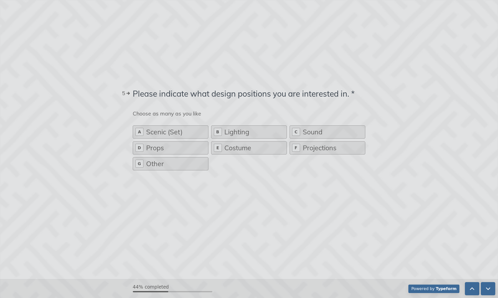

# 🎭 Wesleyan Student Theater DesignerBase

A web app for student theater organizations at Wesleyan, intended for production teams to seek out designers and for designers to make themselves known publicly to the theater community by expressing their interest in design positions.

Designer information is stored in and retreived from a Google Sheet available to the Second Stage company's Team Drive. 

## What I Learned

* Implemented a REST API in Flask with GET and POST methods to send and receive Designer schemas
* Designed a Typeform and integrated a webhook to send responses to a public API
* Integrated the Google Sheets API as a database
* Created a dynamic frontend with Jinja templating and Bootstrap
